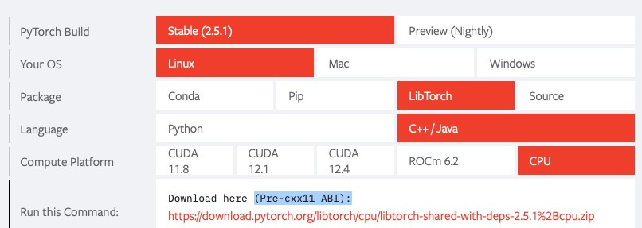
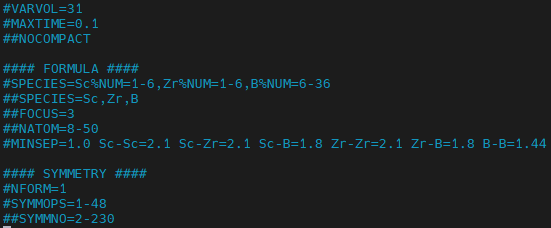

# ACNN

## 官方文档：

https://bonjour221.github.io/notes.github.io/external/external-utilities/

##  <span style="font-size: 30px; color: lightgreen;"> 安装教程

可能需要的安装包准备： gcc(9以上版本)， ase，  pymatgen，  cmake (3以上版本)， qhull  openblas airss  xmgrace  libtorch torchdemo(ACNN) lammps(安装到torchdemo的interface里)

1. https://www.mtg.msm.cam.ac.uk/Codes/AIRSS;
2. https://plasma-gate.weizmann.ac.il/pub/grace/src/; 
3. https://www.openblas.net
 
###  <span style="font-size: 30px; color: red;">  编译流程：

####  <span style="font-size: 25px; color: blue;">  编译openblas
```shell
make -j8 USE_OPENMP=1
make install PREFIX=/...
```

如果在make的时候报错，比如缺少：

就写一个叫env_gcc.sh的脚本，内容包含：如何source你的gcc以及相应的lib库, 这里给出一个例子
```shell
source /public/env/gcc-9.2.0

export LD_LIBRARY_PATH=$LD_LIBRARY_PATH:/public/software/gmp-6.1.2/lib
export LD_LIBRARY_PATH=$LD_LIBRARY_PATH:/public/software/mpfr-4.0.1/lib
export LD_LIBRARY_PATH=$LD_LIBRARY_PATH:/public/software/mpc-1.1.0/lib
```

如果报错：`error while loading shared libraries: libmpfr.so.6: cannot open shared object file: No such file or directory`
要么你按照这个帖子自己安装一个gcc.9.2: https://www.zhihu.com/people/ma-yuan-94-83/posts. 要么你自己安装一个mpfr.

####  <span style="font-size: 25px; color: blue;">  安装airss

<span style="font-size: 20px; color: lightblue;"> 解压
```shell
$ tar -xzvf airss-v0.9.4.tgz

$ ls
bin  CONTRIBUTORS  examples  external  include  lib  LICENCE  makefile  README.md  src  test  VERSION.md
```
<span style="font-size: 20px; color: lightblue;"> 安装
```shell
make

# 必须install， 不然会报出没有cable这个命令
make install
```
<span style="font-size: 20px; color: lightblue;">  意外

1. 如果没有网络, 手动下载spglib、symbol的压缩包并拷贝到external文件夹中, 注意对spglib、symbol的版本有着极其严苛的要求
你最好在一个有网络的机器上, 执行make，搞到这两个安装包，然后把它拷贝到你要安装的机器上
2. 有时候安装报错是因为没有找到关于lpack和blas的两个静态库。我也不知道怎么安装，但是聪明的师弟已经搞好了，发给我了。
你只需要把他们拷贝到lib目录下即可。（libblas.a  liblapack.a  libsymspg.a）


####  <span style="font-size: 25px; color: blue;"> 安装grace

```shell
xmgrace: ./configure --prefix=... ; make -j8 ; make install
```

####  <span style="font-size: 25px; color: blue;"> 安装libtorch

PyTorch官网下载: https://pytorch.org/
    

        
        解压后export即可
####  <span style="font-size: 25px; color: blue;"> 安装acnn

<span style="font-size: 20px; color: lightblue;"> 解压进入torchdemo

<span style="font-size: 20px; color: lightblue;"> 修改prefix.cmake
```shell
# user modify
#set(CUDA_TOOLKIT_ROOT_DIR /path/to/cuda)                                # optional
set(CMAKE_CXX_COMPILER /work/software/gcc-9.2.0/bin/g++)                 # required
set(Torch_DIR /work/home/mayuan/software/libtorch)                       # required
set(OpenBLAS_DIR /work/home/mayuan/software/OpenBLAS-0.3.28/anzhuang)    # required
```

(除前五行需要修改，后面的全注释)，创建文件夹build，进入后cmake
```shell
cmake -B build

make
```


####  <span style="font-size: 25px; color: blue;">  安装acnn和lmp_mpi的接口
<span style="font-size: 20px; color: lightblue;"> 进入torchdemo的interface/lammps

<span style="font-size: 20px; color: lightblue;"> 安装

自己下载个压缩包(lammps-2Aug2023.tar.gz)，更改build_lammps_interface.sh中的压缩文件名之后，

激活intel进行编译（sh build_lammps_interface.sh build 核数），lmp_mpi在文件夹lammps-acnn/build里
```shell
source /work/env/intel2024
source ~/bin/env_gcc.sh 
source /work/env/cmake-3.23

sh build_lammps_interface.sh build 8
```

#### 使用说明

1.  创建任务：
```shell
# 特别注意这个距离是用来筛选优化后不合理的结构的，设置的参数标准可以宽松一点，比如这里H-H只要保证大于0.75即可，没有两个氢原子贴的特别近，即可。
# 这个距离不同于airss里面设置的原子间距离，airss里面设置的原子间距离用于生成结构的，最好保证生成的结构更加贴近于优化后的结构，设置的参数标准可以严格一点，比如这里H-H保证生成的是原子氢，最好大于1.0。

acnn_deploy -p 200 -s CeScH -b Ce-Ce=1.88853,Ce-Sc=1.870015,Ce-H=1.351595,Sc-Sc=1.8515,Sc-H=1.33308,H-H=0.75 -n public
```

2.  修改参数：

```shell
# 修改ICNAR
vi DFT/dyn_vasp_in  

# 修改编译环境和提交任务脚本的头文件以及vasp_std的路径
vi DFT/sub.sh

# 准备POTCAR: 准备POTCAR-元素 (用cat复制，不要用cp)

# 准备airss生成文件的脚本CeScH.cell, 特别注意名字必须是与`acnn_deploy -s`指定的名字一致。
vi RSS/Base/CeScH.cell

# 修改赝势提交脚本
vi POT/sub.sh

# 修改机器学习训练圈数，即：POT/tr的nbatch
vi POT/tr 

# 修改RELAX控制提交作业的脚本，该信息存储在TASK变量中, 特别：激活的环境、编译器路径，每一代优化多少个结构
# 使用lammps优化结构
vi RELAX/dyn_batch_relax
range="1 500"

# 使用ares优化结构
vi RELAX/dyn_batch_relax_bfgs
# parallel hierarchy
frame="500" # 总共提取500个结构
group="100" # 每100个为一组，相应的n_groups=5，表示有5组
warp="12"   # 
job_max=4


# 准备相图端点结构的OUTCAR
acnn_outcar2seed /path/to/OUTCAR /path/to/seed_name.res (ScZrB-ScB2-end-1.res)
```


(4). SEED: 

3.  开始使用：

    (1) 训练集：AIRSS中创建文件夹（与RELAX/dyn_batch_relax中的src地址一致），airss输入文件如下：


        
        运行指令：airss.pl -build -max 5000 -seed ScZrB (即SEED_NAME)

