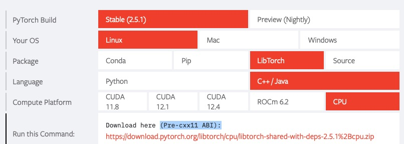

# ACNN

## 官方文档：

https://bonjour221.github.io/notes.github.io/external/external-utilities/
https://gitee.com/wangzf22/acnn

##  <span style="font-size: 30px; color: lightgreen;"> 安装教程

可能需要的安装包准备： gcc(9以上版本)， ase，  pymatgen，  cmake (3以上版本)， qhull  openblas airss  xmgrace  libtorch torchdemo(ACNN) lammps(安装到torchdemo的interface里)

1. https://www.mtg.msm.cam.ac.uk/Codes/AIRSS;
2. https://plasma-gate.weizmann.ac.il/pub/grace/src/; 
3. https://www.openblas.net

安装提醒：ase, pymatgen, qhull, airss 都可以使用 conda install 安装，具体命令为：
```shell
conda install -c conda-forge ase, pymatgen, qhull, airss
```
离线安装方法为：在有线小机器上conda安装，使用 conda pack 打包，上传即可
* 如果ase 无法使用conda安装，单独使用pip install 安装即可
 
###  <span style="font-size: 30px; color: red;">  编译流程：

####  <span style="font-size: 25px; color: blue;"> 1. 编译openblas(安装完成后不需要添加export路径)

网络帖子: https://zhuanlan.zhihu.com/p/631348362

```shell
make -j8 USE_OPENMP=1
make install PREFIX=/...
```

如果在make的时候报错，比如缺少：

就写一个叫env_gcc.sh的脚本，内容包含：如何source你的gcc以及相应的lib库, 这里给出一个例子
```shell
source /public/env/gcc-9.2.0
export LD_LIBRARY_PATH=$LD_LIBRARY_PATH:/public/software/gcc-9.2.0/lib64 
export LD_LIBRARY_PATH=$LD_LIBRARY_PATH:/public/software/gmp-6.1.2/lib 
export LD_LIBRARY_PATH=$LD_LIBRARY_PATH:/public/software/mpfr-4.0.1/lib 
export LD_LIBRARY_PATH=$LD_LIBRARY_PATH:/public/software/mpc-1.1.0/lib 
```

如果报错：`error while loading shared libraries: libmpfr.so.6: cannot open shared object file: No such file or directory`
要么你按照这个帖子自己安装一个gcc.9.2: https://www.zhihu.com/people/ma-yuan-94-83/posts. 要么你自己安装一个mpfr.

####  <span style="font-size: 25px; color: blue;"> 2. 安装airss(安装完成后必须添加export路径)


<span style="font-size: 20px; color: lightblue;"> 1. 上传压缩包airss-v0.9.4.tgz并解压
```shell
$ tar -xzvf airss-v0.9.4.tgz

$ ls
bin  CONTRIBUTORS  examples  external  include  lib  LICENCE  makefile  README.md  src  test  VERSION.md
```

<span style="font-size: 20px; color: lightblue;"> 2. 手动下载spglib、symbol的压缩包到external文件夹中

下载地址在external/(spglib or symbol)/makefile里有，

压缩包的名字要求spglib的压缩包名称是：v1.14.1.zip，symbol的压缩包名称是：symmol.zip

<span style="font-size: 20px; color: lightblue;"> 3. 安装之前拷贝好手动copy三个静态库（libblas.a liblapack.a libsymspg.a 在three_lib.zip里）到lib文件夹中

```shell
make

# 必须install， 不然会报出没有cable这个命令
make install
```
<span style="font-size: 20px; color: lightblue;">  意外

1. 如果没有网络, 手动下载spglib、symbol的压缩包并拷贝到external文件夹中, 注意对spglib、symbol的版本有着极其严苛的要求
你最好在一个有网络的机器上, 执行make，搞到这两个安装包，然后把它拷贝到你要安装的机器上
2. 有时候安装报错是因为没有找到关于lpack和blas的两个静态库。我也不知道怎么安装，但是聪明的师弟已经搞好了，发给我了。
你只需要把他们拷贝到lib目录下即可。（libblas.a  liblapack.a  libsymspg.a）


####  <span style="font-size: 25px; color: blue;"> 3. 安装grace(安装完成后必须添加export路径)


上传grace-latest.tar.gz到服务器，解压，进入文件夹，执行：

```shell
source ~/bin/env_gcc.9.2.0.sh
xmgrace: ./configure --prefix=... ; make -j8 ; make install
```

####  <span style="font-size: 25px; color: blue;"> 4. 安装libtorch(安装完成后不需要添加export路径)

PyTorch官网下载: https://pytorch.org/
    

        
解压后即可。在后续安装torchdemo的时候，会用到libtorch的路径。

####  <span style="font-size: 25px; color: blue;"> 5. 安装cmake3(安装完成后必须添加export路径)

下载好安装包之后直接将其目录下的bin目录加入环境变了就可以使用

####  <span style="font-size: 25px; color: blue;"> 6. 安装acnn(安装完成后必须添加export路径)

<span style="font-size: 20px; color: lightblue;"> 1. 解压进入torchdemo

<span style="font-size: 20px; color: lightblue;"> 2. 修改prefix.cmake
```shell
# 安装CPU版本的ACNN
# 这一部分取消注释并且修改相应的路径
set(CMAKE_CXX_COMPILER /work/software/gcc-9.2.0/bin/g++)               
set(Torch_DIR /work/home/mayuan/software/libtorch)                     
set(OpenBLAS_DIR /work/home/mayuan/software/OpenBLAS-0.3.28/anzhuang)  
```

在安装GPU版本的ACNN之前，需要先安装好CUDA和cuDNN, 教程：https://blog.csdn.net/K_wenry/article/details/138350564
CUDA的版本必须是11.8是， 比11.8高的版本都不行：https://developer.nvidia.com/cuda-11-8-0-download-archive
CUDAnn的版本：https://developer.nvidia.com/compute/cudnn/secure/8.6.0/local_installers/11.8/cudnn-linux-x86_64-8.6.0.163_cuda11-archive.tar.xz
```shell
# 安装GPU版本的ACNN
# 这一部分取消注释并且修改相应的路径
set(CUDA_TOOLKIT_ROOT_DIR /public/home/mayuan/software/cuda/bin)
set(CMAKE_CXX_COMPILER /work/software/gcc-9.2.0/bin/g++)                
set(Torch_DIR /work/home/mayuan/software/libtorch)                      
set(OpenBLAS_DIR /work/home/mayuan/software/OpenBLAS-0.3.28/anzhuang)   
```


**同时特别注意，一定要将其它所有的部分都注释，不然会报错：**
```shell
-- Release
CMake Warning (dev) at CMakeLists.txt:29 (find_package):
  Policy CMP0146 is not set: The FindCUDA module is removed.  Run "cmake
  --help-policy CMP0146" for policy details.  Use the cmake_policy command to
  set the policy and suppress this warning.

This warning is for project developers.  Use -Wno-dev to suppress it.

CMake Error at CMakeLists.txt:44 (find_package):
  By not providing "FindOpenBLAS.cmake" in CMAKE_MODULE_PATH this project has
  asked CMake to find a package configuration file provided by "OpenBLAS",
  but CMake did not find one.

  Could not find a package configuration file provided by "OpenBLAS" with any
  of the following names:

    OpenBLASConfig.cmake
    openblas-config.cmake

  Add the installation prefix of "OpenBLAS" to CMAKE_PREFIX_PATH or set
  "OpenBLAS_DIR" to a directory containing one of the above files.  If
  "OpenBLAS" provides a separate development package or SDK, be sure it has
  been installed.

```

<span style="font-size: 20px; color: lightblue;"> 3. 安装

(除前五行需要修改，后面的全注释)，创建文件夹build，进入后cmake.只需要激活gcc9.2或gcc9.5即可，不需要激活intel
```shell
cmake -B build
cmake --build build --target acnn -j
```


####  <span style="font-size: 25px; color: blue;"> 7. 安装acnn和lmp_mpi的接口(安装完成后必须添加export路径)

<span style="font-size: 20px; color: lightblue;"> 1. 进入torchdemo的interface/lammps

<span style="font-size: 20px; color: lightblue;"> 2. 安装

自己下载个压缩包(lammps-2Aug2023.tar.gz)，更改build_lammps_interface.sh中的压缩文件名之后

激活intel进行编译（sh build_lammps_interface.sh build 核数），lmp_mpi在文件夹lammps-acnn/build里
```shell
source /work/env/intel2024
source ~/bin/env_gcc.sh 
source /work/env/cmake-3.23

sh build_lammps_interface.sh build 8
```

####  <span style="font-size: 25px; color: blue;"> 8. 安装qhull(安装完成后必须添加export路径)
直接下载好代码，make安装之后添加bin目录到bashrc

####  <span style="font-size: 25px; color: blue;"> 9. 安装bfgs
```shell
cd torchdemo/interface/bfgs
cmake -B build
cmake --build build --target acnn_relax -j
```

####  <span style="font-size: 25px; color: blue;"> 10. 范例：所有添加了PATH路径的代码
```shell
export PATH=$PATH:/work/home/mayuan/software/airss/bin
export PATH=$PATH:/work/home/mayuan/software/grace-5.1.25/anzhuang/grace/bin
export PATH=$PATH:/work/home/mayuan/software/torchdemo-v3/build
export PATH=$PATH:/work/home/mayuan/software/torchdemo-v3/interface/lammps/lammps-acnn/build
export PATH=$PATH:/work/home/mayuan/software/qhull-2020.2/bin

export PATH=$PATH:/work/home/mayuan/software/torchdemo-v3-old/interface/airss

export PATH=/work/home/mayuan/software/torchdemo-v3/interface/bfgs/build:$PATH
```

####  <span style="font-size: 25px; color: blue;"> 11. 使用acnn+CSP

<span style="font-size: 20px; color: lightblue;"> 1. 创建任务：
```shell
# 特别注意这个距离是用来筛选优化后不合理的结构的，设置的参数标准可以宽松一点，比如这里H-H只要保证大于0.75即可，没有两个氢原子贴的特别近，即可。
# 这个距离不同于airss里面设置的原子间距离，airss里面设置的原子间距离用于生成结构的，最好保证生成的结构更加贴近于优化后的结构，设置的参数标准可以严格一点，比如这里H-H保证生成的是原子氢，最好大于1.0。

acnn_deploy -p 200 -s CeScH -b Ce-Ce=1.88853,Ce-Sc=1.870015,Ce-H=1.351595,Sc-Sc=1.8515,Sc-H=1.33308,H-H=0.75 -n public
```

<span style="font-size: 20px; color: lightblue;"> 2. 如何准备airss产生结构的文件：

特别注意：airss必须在每个参数前面添加#

<span style="font-size: 15px; color: lightblue;"> 1. 定组分
```shell
#VARVOL=25
#SPECIES=Al%NUM=1,Be%NUM=4
#NFORM=2
#MINSEP=1.5 Al-Al=2.86 Al-Be=2.3 Be-Be=2.25
#COMPACT
```
<span style="font-size: 15px; color: lightblue;"> 2. 变组分方式一: 指定原子数
```shell
#SPECIES=Al,Be
#NATOM=2-10
#FOCUS=2
#NFORM=1-2

#VARVOL=25
#MINSEP=2.0 Al-Al=2.86 Al-Be=2.3 Be-Be=2.25
#COMPACT

#SYMMOPS=1-48
#SLACK=0.25

######效果
symbols    Num   1e-1             1e-5              1e-9           
Al4Be5     9     P2/m (10)        P2/m (10)         P2/m (10)        ./AlBe-150467-5676-3.res
Al4Be4     8     P1 (1)           P1 (1)            P1 (1)           ./AlBe-150467-5676-5.res
Al2Be6     8     Imma (74)        Imma (74)         P-1 (2)          ./AlBe-150467-5676-9.res
Al2Be4     6     P1 (1)           P1 (1)            P1 (1)           ./AlBe-150467-5676-1.res
Al4Be4     8     R32 (155)        R32 (155)         C2 (5)           ./AlBe-150467-5676-7.res
Al4Be2     6     P1 (1)           P1 (1)            P1 (1)           ./AlBe-150467-5676-8.res
Al10Be10   20    R3m (160)        R3m (160)         R3m (160)        ./AlBe-150467-5676-6.res
Al10Be4    14    Pmna (53)        Pmna (53)         Pmna (53)        ./AlBe-150467-5676-10.res
Al4Be6     10    P-42_1m (113)    P-42_1m (113)     P-42_1m (113)    ./AlBe-150467-5676-2.res
Al12Be8    20    P2 (3)           P2 (3)            P2 (3)           ./AlBe-150467-5676-4.res
```
<span style="font-size: 15px; color: lightblue;"> 3. 变组分方式二: 指定各个元素的比例
```shell
#SPECIES=Al%NUM=1-2,Be%NUM=1-2
#NFORM=1-2
#FOCUS=2

#VARVOL=25
#MINSEP=2.0 Al-Al=2.86 Al-Be=2.3 Be-Be=2.25
#COMPACT

#SYMMOPS=1-48
#SLACK=0.25

######效果
symbols    Num   1e-1               1e-5              1e-9           
Al4Be2     6     Fmm2 (42)          Fmm2 (42)         C2 (5)           ./AlBe-148612-5715-4.res
Al2Be2     4     P-3m1 (164)        P3m1 (156)        Cm (8)           ./AlBe-148612-5715-8.res
Al2Be4     6     P4_2/mmc (131)     P4_2/mmc (131)    P4_2/mmc (131)   ./AlBe-148612-5715-5.res
Al4Be2     6     Iba2 (45)          Iba2 (45)         Cc (9)           ./AlBe-148612-5715-1.res
Al4Be4     8     P6_3/mmc (194)     P6_3/mmc (194)    Cmcm (63)        ./AlBe-148612-5715-6.res
AlBe2      3     I4mm (107)         I4mm (107)        Cm (8)           ./AlBe-148612-5715-9.res
Al4Be2     6     P6/mmm (191)       P6/mmm (191)      Cmmm (65)        ./AlBe-148612-5715-2.res
AlBe2      3     P4/mmm (123)       P4/mmm (123)      P4/mmm (123)     ./AlBe-148612-5715-10.res
Al2Be2     4     Cmm2 (35)          Cmm2 (35)         Cmm2 (35)        ./AlBe-148612-5715-3.res
AlBe2      3     I4mm (107)         I4mm (107)        Cm (8)           ./AlBe-148612-5715-7.res
```

<span style="font-size: 20px; color: lightblue;"> 3. 修改参数：

```shell
# 修改ICNAR，ENCUT和KSPACING最重要
vi DFT/dyn_vasp_in  

# 修改编译环境和提交任务脚本的头文件以及vasp_std的路径
vi DFT/sub.sh

# 在DFT目录下准备POTCAR: 准备POTCAR-元素 (用cat复制，不要用cp)

# 准备airss生成文件的脚本CeScH.cell, 特别注意名字必须是与`acnn_deploy -s`指定的名字一致。
vi RSS/Base/CeScH.cell

# 修改机器学习势提交脚本
vi POT/sub.sh

# 修改机器学习训练圈数，即：POT/tr的nbatch
vi POT/tr 

# 修改RELAX控制提交作业的脚本，该信息存储在TASK变量中, 特别：激活的环境、编译器路径，每一代优化多少个结构
# 使用lammps优化结构
vi RELAX/dyn_batch_relax_lmp
prj="/public/home/mayuan/work/63.Li-Pb/"  # prj="/public/home/mayuan/work/63.Li-Pb/"这是错误的，会导致无法得到正确的路径
types="Li Pb"         # 非常重要，不要逗号
press=100             # 非常重要
JOB_NAME="RELAXLiPb"  # 非常重要，判断结构优化任务是否完成

# parallel hierarchy
frame="500" # 总共提取500个结构
group="100" # 每100个为一组，相应的n_groups=5，表示有5组
warp="12"   
job_max=4


# 使用ares优化结构
vi RELAX/dyn_batch_relax_bfgs
frame="500" # 总共提取500个结构
group="100" # 每100个为一组，相应的n_groups=5，表示有5组
warp="12"   # 
job_max=4
```

<span style="font-size: 20px; color: lightblue;"> 4. 准备SEED文件
```shell
# 这种方式可以获得能量和受力
outcar2seed OUTCAR BeH2-P-3m1_50GPa.res
```
**特别注意outcar2seed获得的res文件的头写的是cable-in-out，这是有问题的，如果与文件本身的名称不一致，会导致RELAX/ppr中在获得种子文件时报错。**
这个问题可以通过我的脚本`get_seeds_resfiles.py`解决

```shell
# 这种方式只能获得结构不能获得能量受力
cabal poscar cell < POSCAR > BeH2-P-3m1_50GPa.res
# 必须保证POSCAR里面的坐标形式是Direct, 并且Direct必须首字母大写
```

<span style="font-size: 20px; color: lightblue;"> 5. 提交任务

(1) 开始产生结构：RSS中创建文件夹（与RELAX/dyn_batch_relax中的src地址一致）
运行指令：
```shell        
airss.pl -build -max 5000 -seed ScZrB (即SEED_NAME)
```

(2) 目前产生结构有两种方法

1. 第一种方法airss定组分产生(<span style="font-size: 15px; color: RED;"> **特别注意，产生结构用到的dyn_gsc必须用acnn_deploy自动产生，不能从别的地方拷贝**)
```shell
# 第一步：估算每种元素的原子体积。在SEED目录中执行下面的命令，可以获得每个原子的体积。
cat *.res | acnn_estvol 

# 第二步：在RSS目录中创建AIRSS目录
mkdir AIRSS

# 第三步：将RSS目录中的dyn_gcs拷贝到AIRSS中，修改其中关于原子体积的部分：
# Define atomic volumes
declare -A atomic_volumes=(
    ["H"]=2
    ["Mg"]=11
    ["Ce"]=15
)

# 第四步：产生组分文件，通过执行下面的命令。
#   组分是去重的
#   组分是可以指定倍数的
#   每个组分产生100个结构
python generate_formula_ratios.py Ce:1-2 Mg:1-2 H:1-30 -fu 1 -n 100

# 第五步：执行dyn_gcs，生成结构
./dyn_gcs composition.dat 64
# 当然了你也可以循环执行，提交create_fix_composition.sh脚本即可。其逻辑是当所有组分产生好结构之后，就将其都移动到Base目录中。
```

####  <span style="font-size: 25px; color: blue;"> 注意事项

##### <span style="font-size: 20px; color: lightblue;"> 1. 如果前几代的POT目录下训练机器学习势都失败了，那么后面在训练势的时候，就会爆出如下错误.
```shell
terminate called after throwing an instance of 'c10::Error'
  what():  open file failed because of errno 2 on fopen: No such file or directory, file path:
  ....
Aborted (core dumped)
```
这是因为在训练势的时候要找前一代的势模型，但是没找到，所以报错了。

具体的代码在POT目录的tr脚本中写到了是否续算，只有第0代是不需要续算的，后面的都需要续算并且续算需要用到的模型是其前一代的模型。

##### <span style="font-size: 20px; color: lightblue;"> 2. 关于训练acnn时，并行参数的设置

POT中的sub.sh是训练势函数的提交任务脚本。`#SBATCH --ntasks-per-node=16`和`export OMP_NUM_THREADS=16`必须保持一致。
它的含义是：通过slurm申请16个core进行计算，在拿到这16个core之后用16个进程进行计算。如果设置的OMP_NUM_THREADS小于16，
意味着使用了更少的进程进行计算。

acnn使用的是多进程并行，可以共享内存，提高并行效率。mpirun是多线程并行，无法共享内存但是可以跨节点并行。
```shell
#!/bin/bash
#SBATCH --job-name=TRAINCeScHd
#SBATCH --nodes=1
#SBATCH --ntasks-per-node=16
#SBATCH --cpus-per-task=1
#SBATCH --partition=amd9654
##SBATCH --exclude=node21

source /data/home/mayuan/bin/env_gcc-9.2.0

export OMP_NUM_THREADS=16
export KMP_AFFINITY=granularity=fine,compact,1,0    # Thread affinity
acnn -debug in.acnn

```
##### <span style="font-size: 20px; color: lightblue;"> 3. 关于lammps优化参数的设置
torchdemo-v3/interface/airss/relax_lammps 文件里面包含了lammps结构优化的参数

这里为了加速lammps结构优化，我们注释了第1，3步优化，只保留了2，4步优化。
```shell
# - - - - - - - - - - - - - - - - - - - - - - - - - - - - - - - - - - - - - - - - - - - - - - - - - - - - - - - - - - -
# step 1
# min_style           cg              # sd ...
# group               ept empty
# fix                 1 ept box/relax tri \${pp} dilate partial
# minimize            1.0e-4 1.0e-1 5000 10000

# step 2
min_style           cg              # sd ...
minimize            1.0e-5 1.0e-2 5000 10000
 
# # step 3
# min_style           cg              # sd ...
# fix                 1 all box/relax iso \${pp}
# minimize            1.0e-6 1.0e-3 10000 20000

# step 4
min_style           cg              # sd ...
fix                 1 all box/relax tri \${pp}
minimize            1.0e-8 1.0e-4 20000 20000
# - - - - - - - - - - - - - - - - - - - - - - - - - - - - - - - - - - - - - - - - - - - - - - - - - - - - - - - - - - -
```

##### <span style="font-size: 20px; color: lightblue;"> 4. 如何提升结构预测的效率？

###### <span style="font-size: 18px; color: lightblue;"> 4.1 能量收敛到100meV/atom前帮助收敛的方法。

从产生结构上来看，先产生500个结构, 检查DFT/SCF中每个结构的press是否为指定压强附近。如果偏离太多，说明初始体积不够合理。通过调整产生结构的体积来提高press的精度。

###### <span style="font-size: 18px; color: lightblue;"> 4.2 在POT中用acnn_emodel检查当能量收敛到100meV/atom后，增加RELAX的结构的数量

首先，能量收敛后，增加`RELAX/dyn_batch_relax`中的`range="1 1000"`的结构数量。可以尝试从1000增加到10000或者20000.
其次，能量收敛后，在增加结构数之后，减小`RELAX/ppr`的CAU_FILE和RES. 保证每个配比只提取能量最低的。
```shell
CAU_FILE=$(match_cau $(head -n 200 cac-log|awk '{print $9}'))
RES=$(dedup -s ../../../PD/IT$IT -t 3 $CAU_FILE |grep out || true)

# 这两个变量代表的含义是：挑选出200个能量较低的组分保存至`CAU_FILE`，并且挑选每个组分的前三个能量更低结构保留下来保存到`RES`。
# 可以在增加结构数之后增加200到500，同时减小RES中每个组分的结构数，保持效率不变。
```

##### <span style="font-size: 20px; color: lightblue;"> 5. RELAX中设置结构数的注意事项

##### <span style="font-size: 18px; color: lightblue;"> 5.1 关于RELAX中设置结构数的设置

```shell
frame="500" # 总结构数
group="100" # 每个group文件里面有多少个结构
# 因此有group_aa, group_ab, group_ac, group_ad, group_ae五个group

warp="2"   # 多少个group写在一个task*.sh文件里面
# 5/2=2……1，因此有3个task0.sh, task1.sh, task2.sh

job_max=4   # 最多同时提交多少个任务。

# 比较合理的设置方式是，要保证：
frame/group = warp*job_max
```

##### <span style="font-size: 18px; color: lightblue;"> 5.2  关于各个提交任务的脚本的title的设置引发的错误。
acnn通过acnn_wait <任务名> 来控制一个模块任务的完成和下一个模块任务的进行，如果你在修改提交任务的脚本的时候，发现一个模块还没运行完毕，下一个模块已经开始运行了。那么这就说明你的`#SBATCH --job-name=TRAINAlBeH`设置的有问题（这里以slurm系统作为说明）。

建议你在修改完之后，用grep好好检查一下。

##### <span style="font-size: 18px; color: lightblue;"> 5.3 关于RELAX目录中设置结构优化的types的参数设置问题

dyn_batch_relax_bfgs中types="Al,Be"设置必须有逗号。
```shell
types="Al,Be"
```

dyn_batch_relax_lmp中types="Al Be"不能有逗号。
```shell
types="Al Be"
```
##### <span style="font-size: 18px; color: lightblue;"> 5.4 RELAX的目录下的ppr会在RELAX/IT{x}/RES产生几个log文件，分别代表的含义是：

1. `cam-log` 包含了所有结构的`convex hull信息`
2. `cam1-log`  `cam2-log`  `cam3-log`代表`seed`中的`结构+单质结构`， `seed`中的`结构+二元结构`， `seed`中的`结构+三元结构`
3. `cac-log`从cam-log中挑选出`convex hull`中能量低于2eV且结构数超过100个的结构
4. `cas-log`从`RES`中统计优化成功的`总结构数`和`每个配比的结构数`
5. `cau-log`统计了所有结构优化成功有多少个配比：对cas-log中的结构进行指纹去重


##### <span style="font-size: 20px; color: lightblue;"> 8. 关于PD目录某一代IT${IT}没有新一代结构信息

比如第四代`IT4/cam`里面找不到关于IT4_*开头的任何结构名以及它对应的res文件。

1. 经过仔细的侦察，发现是因为在制作`PD/IT4`时，里面的结构需要用到种子目录`SEED`中的文件，PD中前3代的`res`文件，以及`XSF/IT4`中的`res`文件 (通过检查PD/mkpd而知)；
2. 而`XSF/IT4`中的res来自于`DFT/IT4/SCF`中的文件(通过检查`XSF/ry`而知)
3. 而`DFT/IT4/SCF`中的`res`文件来自于`RELAX/IT3/FPC/SCF`里面的res文件和`RELAX/IT3/FPC/OPT`里面的`res`文件
4. 而`RELAX/IT3/FPC/SCF`和`RELAX/IT3/FPC/OPT`中的文件都是通过处理`RELAX/IT3/RES`中文件得到的(通过检查RELAX/ppr而知)， `ppr`将`RES`中每个配比能量最低的结构放入`RELAX/IT3/FPC/SCF`中，ppr将LIM中的结构放入`RELAX/IT3/FPC/OPT`中。
5. 而`RELAX/IT3/RES`中的文件是通过`ppr`搜集`RELAX/IT3`中的所有`${seed}*-out.res`文件得到的，这个文件就是lammps结构优化结束后的文件，如果结构优化失败就没有`${seed}*-out.res`这些文件
6. `ppr`是如何收集RES中的结构文件呢？
```shell
# 生成convex hull
# 通过在RELAX/IT*/RES中执行下面的命令，可以知道每一代新生成的结构的convexhull的变化
ca -m -l |sort -g -k 6 -k 5 > cam-log 2>&1
# 这一行命令用于提取高于convex hull 2eV以内的结构，可以适当放松2eV的限制
# $11 > 100 表示提取该组分中结构数超过100个结构的配比
awk '$11 > 100 || $6 < 2' cam${focus}-log |sort -g -k6 -k5 > cac-log
# 提取cac-log中前200个结构
CAU_FILE=$(match_cau $(head -n 200 cac-log|awk '{print $9}'))
# 在CAU_FILE中每个配比挑选5个结构
RES=$(dedup -s ../../../PD/IT$IT -t 5 $CAU_FILE |grep out || true)
```
6. 所以现在唯一的问题源头就是检查是不是结构优化出错了！！！
7. `lammps`的结构优化是通过`relax_lammps "mpirun -np 1 lmp_mpi" AlBe-57325-3298-3474.res /data/home/mayuan/work/61.Al-Be/POT/IT3/model-restart/model-100000 "Al Be" 50`实现的。而其中`relax_lammps`中包含了调用lammps的命令`$exe -in "$sign".in > "$sign".conv 2>&1`(这里的exe就是lammps的绝对路径)， `"$sign".conv`就是lammps结构优化的输出文件。
8. 通过检查`"$sign".conv`发现，确实是结构优化出现了问题，在node75中发现了结构优化有错，重新优化即可。

##### <span style="font-size: 20px; color: lightblue;"> 9. 检查机器学习势的准确度。

```shell
emodel model-restart/model-100000 DT/ > ss 2>&1
```

新版本的acnn用下面的命令检查
```shell
acnn_emodel model-restart/model-100000 DT/ > ss 2>&1
```

##### <span style="font-size: 20px; color: lightblue;"> 10. XSF中的ry可以调整受力筛选精度

XSF中ry中的`acnn_checkdt 50`设置了受力的误差阈值。代表挑选受力误差小于50eV/A的结构。

##### <span style="font-size: 20px; color: lightblue;"> 11. DFT/batch_vasp中可以用acnn_limitjob来限制提交的DFT任务数
acnn_limitjob FPCeBaH 50 可以用来限制提交的DFT任务数为50个

